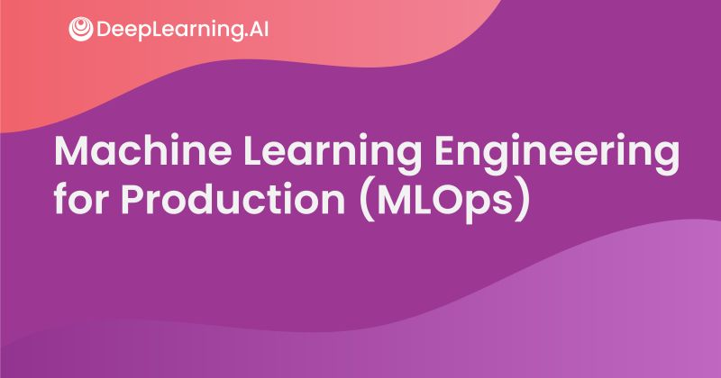

# Machine Learning Engineering for Production

Become a Machine Learning expert. Put your machine learning knowledge to work, and expand your production engineering capabilities and begin to turn your ideas into realities.

### My Scores
- [Course 1 - Introduction to Machine Learning in Production: 100%](pics/MLOPs-intro.png)
- [Course 2 - Machine Learning Data Life Cycle in Production: 100%](pics/MLOPs-data.png)
- [Course 3 - Machine Learning Modelling Pipelines in Production: 100%](pics/MLOPs-pipelines.png)
- [Course 4 - Welcome to Deploying Machine Learning Models in Production: 98%](pics/MLOPs-deployment.png)

## Course Structure
Each course is spread out in weeks, and are made up of video slides, lab sessions, quizzes, assignments, related course materials, code and data

## Course 1: Introduction to Machine Learning in Production

### Week 1
#### Slides
- [Machine Learning Project Life Cycle](C1-Introduction-to-machine-learning-in-production/Week1/C1_W1.pdf)
#### Labs
- [Deploying a Machine Learning Model](C1-Introduction-to-machine-learning-in-production/Week1/server.ipynb)
- [Consuming a Machine Learning Model](C1-Introduction-to-machine-learning-in-production/Week1/client.ipynb)

### Week 2
#### Slides
- [Select and train a Model](C1-Introduction-to-machine-learning-in-production/Week2/C1_W2.pdf)
#### Labs
- [Ungraded Lab: A journey through Data](C1-Introduction-to-machine-learning-in-production/Week2/C1W2_Ungraded_Lab_Birds_Cats_Dogs.ipynb)
- [Ungraded Lab: Data Labeling](C1-Introduction-to-machine-learning-in-production/Week2/C1W3_Data_Labeling_Ungraded_Lab.ipynb)

### Week 3
#### Slides
- [Define data and establish baseline](C1-Introduction-to-machine-learning-in-production/Week3/C1_W3.pdf)
#### Labs
- [Ungraded Lab: Data Labeling](C1-Introduction-to-machine-learning-in-production/Week3/C1W3_Data_Labeling_Ungraded_Lab.ipynb)

## Course 2: Machine Learning Data Life Cycle in Production

### Week 1
#### Slides
- [Collecting, Labeling, and Validating Data](C2-Machine-learning-data-life-cycle-in-production/Week1/C2_W1.pdf)
#### Labs
- [Ungraded Lab: TFDV Exercise](C2-Machine-learning-data-life-cycle-in-production/Week1/C2_W1_Lab_1_TFDV_Exercise.ipynb)
#### Assignments
- [Assignment: Data Validation](C2-Machine-learning-data-life-cycle-in-production/Week1/C2W1_Assignment.ipynb)

### Week 2
#### Slides
- [Feature Engineering, Transformation and Selection](C2-Machine-learning-data-life-cycle-in-production/Week2/C2_W2.pdf)
#### Labs
- [Ungraded Lab: Simple Feature Engineering](C2-Machine-learning-data-life-cycle-in-production/Week2/C2_W2_Lab_1_Simple_Feature_Engineering.ipynb)
- [Ungraded Lab: Feature Engineering Pipeline](C2-Machine-learning-data-life-cycle-in-production/Week2/C2_W2_Lab_2_Feature_Engineering_Pipeline.ipynb)
- [Ungraded Lab: Feature Selection](C2-Machine-learning-data-life-cycle-in-production/Week2/C2_W2_Lab_3_Feature_Selection.ipynb)

### Week 3
#### Slides
- [Data Journey and Data Storage](C2-Machine-learning-data-life-cycle-in-production/Week3/C2_W3.pdf)
#### Labs
- [Ungraded Lab: Walkthrough of ML Metadata](C2-Machine-learning-data-life-cycle-in-production/Week3/C2_W3_Lab_1_MLMetadata.ipynb)
- [Ungraded Lab: Iterative Schema with TFX and ML Metadata](C2-Machine-learning-data-life-cycle-in-production/Week3/C2_W3_Lab_2_IterativeSchema.ipynb)
#### Assignments
- [Week 3 Assignment: Data Pipeline Components for Production ML](C2-Machine-learning-data-life-cycle-in-production/Week3/C2W3_Assignment.ipynb)

### Week 4
#### Slides
- [Advanced Labeling, Augmentation and Data Preprocessing](C2-Machine-learning-data-life-cycle-in-production/Week4/C2_W4.pdf)
#### Labs
- [Ungraded Lab: Feature Engineering with Weather Data](C2-Machine-learning-data-life-cycle-in-production/Week4/C2_W4_Lab_1_WeatherData.ipynb)
- [Ungraded Lab: Feature Engineering with Accelerometer Data](C2-Machine-learning-data-life-cycle-in-production/Week4/C2_W4_Lab_2_Signals.ipynb)
- [Ungraded Lab: Feature Engineering with Images](C2-Machine-learning-data-life-cycle-in-production/Week4/C2_W4_Lab_3_Images.ipynb)

## Course 3: Machine Learning Modelling Pipelines in Production

### Week 1
#### Slides
- [Neural Architecture Search](C3-Machine-learning-modelling-pipelines-in-production/Week1/C3_W1.pdf)
#### Labs
- [Ungraded Lab: Intro to Keras Tuner](C3-Machine-learning-modelling-pipelines-in-production/Week1/C3_W1_Lab_1_Keras_Tuner.ipynb)
- [Ungraded Lab: Hyperparameter tuning and model training with TFX](C3-Machine-learning-modelling-pipelines-in-production/Week1/C3_W1_Lab_2_TFX_Tuner_and_Trainer.ipynb)

### Week 2
#### Slides
- [Model Resource Management Techniques](C3-Machine-learning-modelling-pipelines-in-production/Week2/C3_W2.pdf)
#### Labs
- [Ungraded lab: Manual Feature Engineering](C3-Machine-learning-modelling-pipelines-in-production/Week2/C3_W2_Lab_1_Manual_Dimensionality.ipynb)
- [Ungraded lab: Algorithmic Dimensionality Reduction ](C3-Machine-learning-modelling-pipelines-in-production/Week2/C3_W2_Lab_2_Algorithmic_Dimensionality.ipynb)
- [Ungraded Lab: Quantization and Pruning](C3-Machine-learning-modelling-pipelines-in-production/Week2/C3_W2_Lab_3_Quantization_and_Pruning.ipynb)

### Week 3
#### Slides
- [High Performance Modeling](C3-Machine-learning-modelling-pipelines-in-production/Week3/C3_W3.pdf)
#### Labs
- [Ungraded lab: Distributed Strategies with TF and Keras](C3-Machine-learning-modelling-pipelines-in-production/Week3/C3_W3_Lab_1_Distributed_Training.ipynb)
- [Ungraded Lab: Knowledge Distillation](C3-Machine-learning-modelling-pipelines-in-production/Week3/C3_W3_Lab_2_Knowledge_Distillation.ipynb)
- [Ungraded lab: Distributed Strategies with TF and Keras](C3-Machine-learning-modelling-pipelines-in-production/Week3/C3W3_Colab_Lab1_Distributed_Training.ipynb)

### Week 4
#### Slides
- [Model Analysis](C3-Machine-learning-modelling-pipelines-in-production/Week4/C3_W4.pdf)
#### Labs
- [Ungraded Lab: TensorFlow Model Analysis](C3-Machine-learning-modelling-pipelines-in-production/Week4/C3_W4_Lab_1_TFMA.ipynb)
- [Ungraded Lab: Model Analysis with TFX Evaluator](C3-Machine-learning-modelling-pipelines-in-production/Week4/C3_W4_Lab_2_TFX_Evaluator.ipynb)
- [Ungraded Lab: Fairness Indicators](C3-Machine-learning-modelling-pipelines-in-production/Week4/C3_W4_Lab_3_Fairness_Indicators.ipynb)

### Week 5
#### Slides
- [Interpretability](C3-Machine-learning-modelling-pipelines-in-production/Week5/C3_W5.pdf)
#### Labs
- [Ungraded lab: Shapley Values](C3-Machine-learning-modelling-pipelines-in-production/Week5/C3_W5_Lab_1_Shap_Values.ipynb)
- [Ungraded lab: Permutation Feature Importance](C3-Machine-learning-modelling-pipelines-in-production/Week5/C3_W5_Lab_2_Permutation_Importance.ipynb)

## Course 4: Welcome to Deploying Machine Learning Models in Production

### Week 1
#### Slides
- [Model Serving](C4-Welcome-to-deploying-machine-learning-models-in-production/Week1/C4_W1.pdf)
#### Labs
- [Ungraded lab: Serve a model with TensorFlow Serving](C4-Welcome-to-deploying-machine-learning-models-in-production/Week1/C4_W1.pdf)

### Week 2
#### Slides
- [Model Serving Architecture](C4-Welcome-to-deploying-machine-learning-models-in-production/Week1/C4_W1.pdf)
#### Labs
- [Ungraded Lab (Optional): ETL Pipelines and Batch Predictions with Apache Beam and Tensorflow](C4-Welcome-to-deploying-machine-learning-models-in-production/Week2/C4_W2_Lab_4_ETL_Beam/C4_W2_Lab_4_Apache_Beam_and_Tensorflow.ipynb)

### Week 3
#### Slides
- [Model Management and Delivery](C4-Welcome-to-deploying-machine-learning-models-in-production/Week3/C4_W3.pdf)
#### Labs
- [Ungraded Lab: Building ML Pipelines with Kubeflow](C4-Welcome-to-deploying-machine-learning-models-in-production/Week3/C4_W3_Lab_1_Kubeflow_Pipelines.ipynb)
- [Ungraded Lab: Developing Custom TFX Components](C4-Welcome-to-deploying-machine-learning-models-in-production/Week3/C4_W3_Lab_2_TFX_Custom_Components.ipynb)

### Week 4
#### Slides
- [Model Monitoring](C4-Welcome-to-deploying-machine-learning-models-in-production/Week4/C4_W4.pdf)

## Disclaimer
The solutions presented are intended to serve as reference for other learners who enroll in this course.